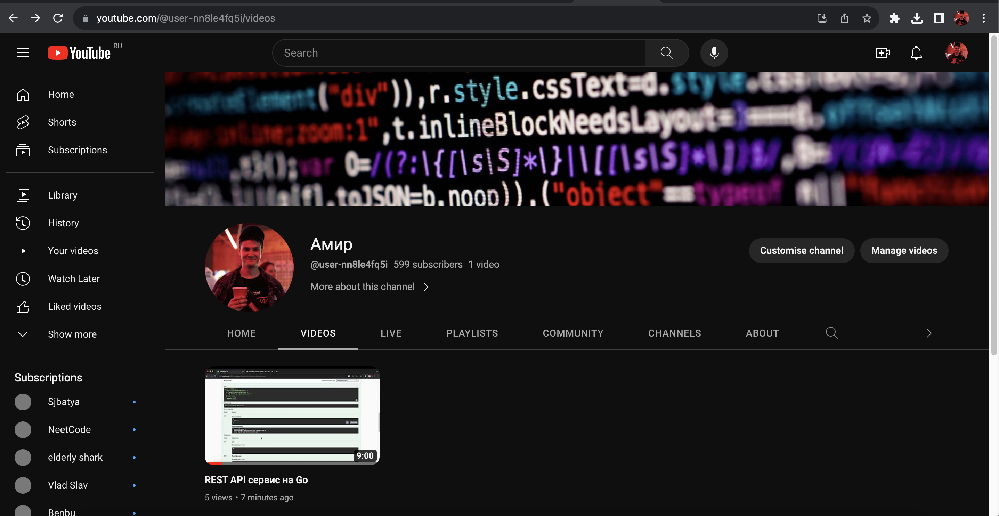

# REST API service for Avito user segments
I've recorded the video-presentation on YouTube https://youtu.be/XtQMn-BsoVw !

Application made with Golang using Gin framework. Includes Docker container integrated with PostgreSQL database.
It automatically runs all migrations to db, so you don't need to worry about it.

You can use adminer to soft db connect.

Use Swagger to feel good :)

## Dependencies

- Docker
- Docker compose

## Running

`make build && make run`

- Base URL: `http://localhost:8001/`
- Swagger URL: `http://localhost:8001/swagger/index.html#/`

Endpoints:
- GET /segments
- POST /segments
- GET /segments/id
- PUT /segments/id
- DELETE /segments/id

- GET /users
- POST /users
- GET /users/id
- PUT /users/id
- DELETE /users/id
- POST /users/id/segments
- GET /users/id/segments
- DELETE /users/id/segments

## Swagger

