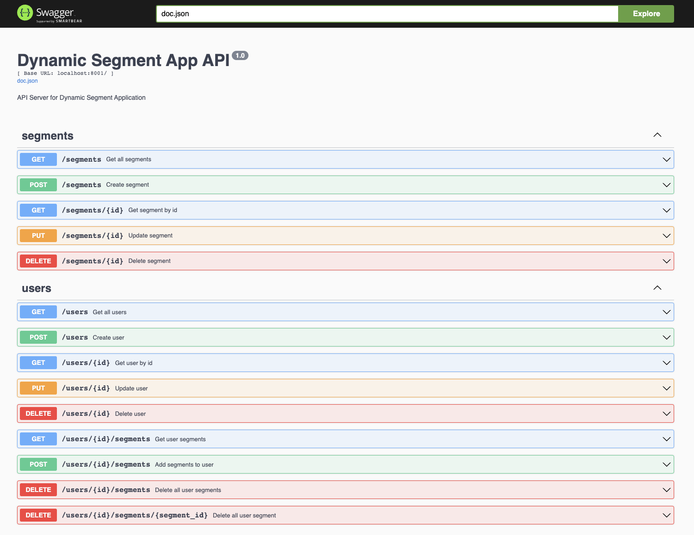

# golang-rest-api for Avito user segments
REST API made with Golang using Gin framework. Includes Docker container integrated with PostgreSQL database.

## Dependencies

- Docker
- Docker compose

## Running

`make build && make run`

- Base URL: `http://localhost:8001/api/v1`
- Swagger URL: `http://localhost:8001/swagger/index.html#/`

Endpoints:
- GET /users
- POST /users
- GET /users/id
- PUT /users/id
- DELETE /users/id

## Swagger

